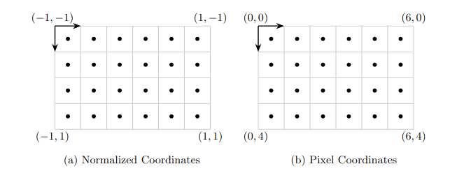

# nvTorchCam

## Table of Contents
- [Purpose](#purpose)
- [Installation](#installation)
- [Usage](#usage)
  - [Notation and Inferred Batch Size](#1-notation-and-inferred-batch-size)
  - [Camera Models](#2-camera-models)
    - [Supported Camera Models](#21-supported-camera-models)
    - [Creating Cameras](#22-creating-cameras)
    - [Essential Camera Functions](#23-essential-camera-functions)
    - [Tensor-like Properties](#24-tensor-like-properties)
    - [Heterogeneous Camera Batches](#25-heterogeneous-camera-batches)
    - [Stacking in Pytorch dataloaders](#26-stacking-in-pytorch-dataloaders)
  - [Image coordinates, Cropping, and Interpolation](#3-image-coordinates-cropping-and-interpolation)
    - [Normalized image coordinates](#31-normalized-image-coordinates)
    - [Cubemap coordinates](#32-cubemap-coordinates)
    - [TensorDictionaryAffineCamera & Cropping](#33-tensordictionaryaffinecamera--cropping)
    - [Interpolation](#34-interpolation)
  - [Warping](#4-warping)
- [Running Examples](#running-examples)
- [FoVA-Depth: More Examples Using nvTorchCam](#fova-depth-more-examples-using-nvtorchcam)
- [References](#references)
- [Citation](#citation)
    

## Purpose

The purpose of this library is to facilitate the development of PyTorch models that leverage plane-sweep volumes (PSV) and related concepts such as sphere-sweep volumes or epipolar attention, in a way that is agnostic to the camera's projection model. This enables effortless transitions between camera models without modifying the network implementation. Originally designed for this flexibility, the library is also fully differentiable, allowing for other use cases such as optimizing camera parameters.

A clear illustration of this library's utility can be seen in the comparison between casMVSNet [3] and 360MVSNet [1]. These methods share nearly identical methodology; their primary distinction lies in their implementation for different camera models: casMVSNet for the pinhole camera and 360MVSNet for the Equirectangular panorama (ERP). With nvTorchCam, these two methods can effortlessly share implementation.

Additionally, the library facilitates consistent data loading across various camera models in PyTorch, alongside a suite of utilities for image warping tasks such as undistortion, cost-volume construction, and stereo rectification, including rectification of ERPs. It also introduces capabilities for MVS fusion inspired by [MVSNet Pytorch](https://github.com/xy-guo/MVSNet_pytorch/blob/master/eval.py), but generalized to work with any camera model and run on GPU.

## Installation

First, clone the repo and navigate to the project root. 

This repo was tested with dependencies: 

- torch                     2.2.1
- nvdiffrast                0.3.1 (for cubemap operations)
- plyfile                   1.0 (examples only)
- imageio                   2.31.1 (examples only)
- opencv-python             4.8.0.74 (examples and tests)

We offer various installation options: 

- **Basic Installation**. To install the package with minimal dependencies, run:
```bash
pip install .
```
- **Cubemap Interpolation**. To install with `nvdiffrast` for cubemap interpolation, run:
```bash
pip install .[cubemap]
```
- **Examples and Testing**. To install dependencies for testing and running examples, run:
```bash
pip install .[examples_test]
```
- **All Dependencies**. To install all optional dependencies, run:
```bash
pip install .[all]
```

After installation, tests can be run with:
```bash
bash run_test.sh
```

## Usage

### 1. Notation and Inferred Batch Size

The library is designed to intelligently infer and handle tensor dimensions that resemble batches. This capability allows for efficient manipulation of data in both singular and batched forms. The process and its documentation are best illustrated through an example:

Consider the doc-string for the function `utils.apply_matrix`, which transforms batches of point groups using batches of matrices:

```python 
def apply_matrix(A: Tensor, pts: Tensor) -> Tensor:
    """ Transform batches of groups of points by batches of matrices
    Args:
        A: (*batch_shape, d, d)
        pts: (*batch_shape, *group_shape, d) 
    Returns:
        : (*batch_shape, *group_shape, d)
           
    """
```

The function's input and output shapes—`(*batch_shape, d, d)` for matrices, and `(*batch_shape, *group_shape, d)` for points—demonstrate its flexibility to work with both individual elements, batches, and batches of groups:

| Input Shapes         | Output Shape      | Description                                             |
|----------------------|-------------------|---------------------------------------------------------|
| `(3,3)` and `(3,)`   | `(3,)`            | Multiply a single vector by a single matrix.            |
| `(3,3)` and `(10,3)` | `(10,3)`          | Multiply a group of 10 vectors by a single matrix.      |
| `(3,3)` and `(12,6,4,3)` | `(12,6,4,3)`    | Multiply a group of `(12,6,4)` vectors by a single matrix. |
| `(4,3,3)` and `(4,3)` | `(4,2)`          | Multiply a batch of 4 vectors by a batch of 4 matrices. |
| `(5,4,3,3)` and `(5,4,10,3)` | `(5,4,10,3)` | Multiply a batch `(5,4)` groups of `10` vectors by a batch of  `(5,4)` matrices.  |

This capability enables the function to apply matrix transformations efficiently across varying dimensions of data, accommodating both individual and batch processing needs.

Most other functions and Camera objects have similar inferred batching capabilities and are documented similarly.


### 2. Camera Models
This library abstracts different camera models as objects that are inherited from the `CameraBase` class. These camera objects encapsulate functionalities for 3D to 2D projections, ray casting from pixels, and obtaining camera rays among other features. For details of important camera functions input and output shapes please see the doc-strings for `CameraBase` functions: `pixel_to_ray`, `project_to_pixel`, `get_camera_rays`, and `unproject_depth`.

#### 2.1 Supported Camera Models

The library includes a variety of camera models: 

- `PinholeCamera`
- `OrthographicCamera`
- `OpenCVCamera`
- `EquirectangularCamera`
- `OpenCVFisheyeCamera]`
- `BackwardForwardPolynomialFisheyeCamera`
- `Kitti360FisheyeCamera`
- `CubeCamera`

In this part, we document the projection function (i.e., how `project_to_pixel` works) and the parameters of each supported camera model. We denote the 3D point as (x, y, z) and the projected point on the sensor as (u, v), or (u, v, w) in the case of the cubemap. We also comment on how the inverse works (i.e., how `pixel_to_ray` works).

| | Parameters | Projection  | Inverse |
|----------------------------------------|--------------------------------------------------------------|----------------------------------------------------------------------------------------------------------------------------------------------------------------------------------------------------------------------------------------------------------------------------------------|----------------------------------------------------------|
| `PinholeCamera` | $f_0, f_1, c_0, c_1$ | $u', v' = \frac{x}{z}, \frac{y}{z}$ <br> $u, v = f_0 u' + c_0, f_1 v' + c_1$ | Analytic |
| `OrthographicCamera` | $f_0, f_1, c_0, c_1$ | $u', v' = x, y$  <br>  $u, v = f_0 u' + c_0, f_1 v' + c_1$ | Analytic |
| `OpenCVCamera` | $f_0, f_1, c_0, c_1$ <br> $k_0, k_1, k_2, k_3$<br> $k_4, k_5, p_0, p_1$ | $x', y' = x/z, y/z$ <br> $r^2 = {x'}^2 + y'^2$ <br>  $D_{radial} = \frac{1 + k_0 r^2 + k_1 r^4 + k_2 r^6}{1 + k_3 r^2 + k_4 r^4 + k_5 r^6}$  <br> $u' = x' * D_{radial} + 2 p_0 x' y' + p_1(r^2 + 2 {x'}^2)$ <br>  $v' = y' * D_{radial} + p_0(r^2 + 2{y'}^2) + 2 p_1 x' y'$ <br>  $u, v = f_0 u' + c_0, f_1 v' + c_1$ | Newton's Method to convert from $u',v'$ back to $x', y'$. |
| `EquirectangularCamera`$^1$ | $f_0, f_1, c_0, c_1$   | $r = \sqrt{x^2 + y^2 + z^2}$ <br> $u' = acos(-\frac{y}{r})$ <br> $v' = atan2(x, z)$ <br> $u, v = f_0 u' + c_0, f_1 v' + c_1$ | Analytic |
| `OpenCVFisheyeCamera`$^2$ | $f_0, f_1, c_0, c_1$ <br> $k_0, k_1, k_2, k_3$ | $x', y', z' = \frac{x, y, z}{\sqrt{x^2 + y^2 + z^2}}$ <br> $\theta = acos(z')$ <br> $\theta_d = \theta (1 + k_0 \theta^2 + k_1 \theta^4 + k_2 \theta^6 + k_3 \theta^8)$ <br> $x'', y'' = \frac{x', y'}{\sqrt{x'^2 + y'^2}}$ <br> $u', v' = \theta_d (x'', y'')$ <br> $u, v = f_0 u' + c_0, f_1 v' + c_1$ <br>  | Newton's Method to convert $\theta_d$ to $\theta$. |
| `BackwardForward`<br>`PolynomialFisheyeCamera`$^3$ | $f_0, f_1, c_0, c_1$ <br> $p_0, p_1 \dots p_N$ <br> $q_0, q_1 \dots q_M$ | $x', y', z' = \frac{x, y, z}{\sqrt{x^2 + y^2 + z^2}}$ <br> $\theta = acos(z')$ <br> $\theta_d = p_0 + p_1 \theta + p_2 \theta^2 \dots p_N \theta^N$ <br> $x'', y'' = \frac{x', y'}{\sqrt{{x'}^2 + {y'}^2}}$ <br> $u', v' = \theta_d x'', \theta_d y''$ <br> $u, v = f_0 u' + c_0, f_1 v' + c_1$ | Calculated used a "backward polynomial": $\theta = q_0 + q_1 \theta_d + q_2 \theta_d^2 \dots  q_M \theta_d^M$. It is up to the user to specify this polynomial when the camera is instantiated such that it is an approximate inverse of the "forward polynomial": $p_0 + p_1 \theta + p_2 \theta^2 \dots p_N \theta^N$. |
| `Kitti360FisheyeCamera` | $f_0, f_1, c_0, c_1$ <br> $k_0, k_1, x_i$ | $x', y', z' = \frac{x, y, z}{\sqrt{x^2 + y^2 + z^2}}$ <br> $x'', y'' = \frac{x'}{z' + x_i}, \frac{y'}{z' + x_i}$ <br> $r^2 = {x''}^2 + {y''}^2$ <br> $r_d^2 = 1 + k_0  r^2 + k_1 r^4$ <br> $u', v' = r_d^2 x'', r_d^2 y''$ <br> $u, v = f_0 u' + c_0, f_1 v' + c_1$ | Newton's Method for $r^2$ back to $r_d^2$, rest is analytic. |
| `CubeCamera` | -  | $u, v, w = \frac{x, y, z}{\|x,y,z\|_{inf}}$ if `depth_is_along_ray` = False <br> $u, v, w = \frac{x, y, z}{\|x,y,z\|_2}$ if `depth_is_along_ray` = True | Analytic |

Notes:
1. Rather than setting the parameters $f_0, f_1, c_0, c_1$ when calling the camera's make function it may be more intuitive to specify angular ranges. You can do this in the make function by setting phi_range and theta_range rather than intrinsics. Then $f_0, f_1, c_0, c_1$ will be set as: <br>
$\theta_{range} = (\theta_{min}, \theta_{max})$ <br>
$\phi_{range} = (\phi_{min}, \phi_{max})$ <br>
$f_0 = 2/(\phi_{max}-\phi_{min})$ <br>
$f_1 = 2/(\theta_{max}-\theta_{min})$ <br>
$c_0 = (\phi_{max} + \phi_{min})/(\phi_{max} - \phi_{min})$ <br>
$c_1 = (\theta_{max} + \theta_{min})/(\theta_{max} - \theta_{min})$ <br>
For full 360, $\phi_{min}=-\pi, \phi_{max}=\pi, \theta_{min}=0, \theta_{max}=\pi$.
2. Our implementation is equivalent to the OpenCV formulation for points in front of the camera but is extended to work with points behind the camera; that is, it can work with cameras with a Field of View (FoV) greater than 180°.
3. This camera is similar to `OpenCVFisheyeCamera` but handles arbitrary polynomials in the projection function represented by the coefficients $p_0\dots p_N$, and requires the user to specify a backward polynomial for converting pixels to rays. This polynomial inverse is potentially much faster than Newton's Method. Also, note if optimizing the camera's backward polynomial, the forward polynomial will NOT automatically update to remain an approximate inverse to the backward polynomial and vice versa.


#### 2.2 Creating Cameras

Cameras must be created via their static 'make' method e.g.
```python 
   import nvtorchcam.cameras as cameras
   pin_cam = cameras.PinholeCamera.make(torch.eye(3))
   ortho_cam = cameras.OrthographicCamera.make(torch.eye(3))
```

cameras also can be made with arbitrary batch shapes e.g.
```python 
   intrinsics = torch.eye(3).reshape(1,1,3,3).expand(2,4,3,3)
   ortho_cam = cameras.OrthographicCamera.make(intrinsics)
   print(ortho_cam.shape) #torch.Size([2, 4])
```

This creates a batch of orthographic cameras of shape (2,4).

#### 2.3 Essential Camera Functions
The most essential functions of cameras are: `project_to_pixel`, `pixel_to_ray`. We give an example of these functions for the very simple orthographic camera model.

Example: `project_to_pixel`

```python
>>> cam = cameras.OrthographicCamera.make(torch.eye(3), z_min=0.0)
>>> pts = torch.tensor([[ 1.,  2.,  5.],
                        [ 3., -2.,  8.],
                        [-2.,  3., -5.]])
>>> pixel, depth, valid = cam.project_to_pixel(pts)
>>> pixel
tensor([[ 1.,  2.],
        [ 3., -2.],
        [-2.,  3.]])
>>> depth
tensor([ 5.,  8., -5.])
>>> valid
tensor([ True,  True, False]) #-5 < z_min so last point is marked invalid
```

This example simply shows a scalar camera acting on a group of three points, but cameras can have arbitrary batch-like dimensions and operate on arbitrary groups of points. This is shown in the doc-string for `project_to_pixel`: 

```python
    def project_to_pixel(self, pts: Tensor, depth_is_along_ray: bool = False) -> Tuple[Tensor, Tensor, Tensor]:
        """
        Args:
            pts: (*self.shape, *group_shape, 3)
            depth_is_along_ray: bool

        Returns:
            pix: (*self.shape, *group_shape, pixel_dim)
            depth: (*self.shape, *group_shape)
            valid: (*self.shape, *group_shape)
        """
```

Example: `pixel_to_ray`

```python
>>> cam = cameras.OrthographicCamera.make(torch.eye(3), z_min=0.0)
>>> pix = torch.tensor([[ 1.,  2.],
                        [ 3., -2.],
                        [-2.,  3.]])
>>> origin, dirs, valid = cam.pixel_to_ray(pix, unit_vec = False) #directions can be returned as unit vectors or scaled such that the z component = 1
>>> origin
tensor([[ 1.,  2.,  0.],
        [ 3., -2.,  0.],
        [-2.,  3.,  0.]])
>>> dirs
tensor([[0., 0., 1.],
        [0., 0., 1.],
        [0., 0., 1.]])
>>> valid
tensor([True, True, True])
```

Please refer to the source code for useful camera functions such as: `get_camera_rays` and `unproject_depth`.

#### 2.4 Tensor-like Properties

In addition to `.shape`, camera models support a number of other tensor-like operations such as: `shape`, `device`, `to`, `reshape`, `permute`, `transpose`, `squeeze`, `unsqueeze`, `expand`, `flip`, `detach` and `clone`. Tensor-slicing operations of cameras are also supported. Note that cameras may return views or copies of the original camera data.

One can also get an iterator of the camera parameters with the method `named_tensors.` This may be useful for setting which parameters `requires_grad`.


#### 2.5 Heterogeneous Camera Batches

Heterogeneous batches of cameras (batches with multiple camera models) can be created using `torch.cat` and `torch.stack`, for example:

```python
>>> pin_cam = cameras.PinholeCamera.make(torch.eye(3))
>>> ortho_cam = cameras.OrthographicCamera.make(torch.eye(3))
>>> mixed_batch = torch.stack([pin_cam, ortho_cam], dim=0)
>>> print(type(mixed_batch), mixed_batch.shape)
<class 'nvtorchcam.cameras._HeterogeneousCamera'> torch.Size([2])
```

When slicing heterogeneous batches, the batch will devolve to homogeneous if applicable:

```python 
   >>> print(type(mixed_batch[0]))
   <class 'nvtorchcam.cameras.PinholeCamera'>
   >>> print(type(mixed_batch[1])) 
   <class 'nvtorchcam.cameras.OrthographicCamera'>
```

Note: `_HeterogeneousCamera` should not be created directly. Also, note that CubeCamera objects cannot be used in heterogeneous batches and will raise an error if they are concatenated with another type.

#### 2.6 Stacking in Pytorch dataloaders

When the library is imported, `CameraBase` objects are added to PyTorch's default `collate_fn`. This means that they can be returned just like tensors in `torch.utils.data.Dataset`'s `__getitem__` method and will be properly stacked, even if different dataset samples use different camera objects.


### 3. Image coordinates, Cropping, and Interpolation

#### 3.1 Normalized image coordinates
This library uses normalized coordinates for image manipulation, similar to `torch.nn.functional.grid_sample` with `align_corners=False`. This approach allows for easy image resizing without changing camera intrinsics. However, adjusting intrinsics for cropping or padding becomes more complex so utility functions for this are explained [here](#tensordictionaryaffinecamera--cropping). Detailed documentation is provided in the following section. Coordinate conventions illustrated in the figure:



To switch between normalized and unnormalized coordinates, use:
- `normalized_pts_from_pixel_pts`: Converts pixel to normalized points.
- `pixel_pts_from_normalized_pts`: Converts normalized to pixel points.

However, it is recommended to normalize the camera's intrinsic matrix upon creation, ensuring that the camera’s `project_to_pixel` function directly converts 3D points into normalized coordinates (see next section)

We can get a grid of normalized pixel centers with `utils.get_normalized_grid`

```python 
>>> grid = utils.get_normalized_grid((4,6),'cpu')
>>> grid[:,:,0]
tensor([[-0.8333, -0.5000, -0.1667,  0.1667,  0.5000,  0.8333],
        [-0.8333, -0.5000, -0.1667,  0.1667,  0.5000,  0.8333],
        [-0.8333, -0.5000, -0.1667,  0.1667,  0.5000,  0.8333],
        [-0.8333, -0.5000, -0.1667,  0.1667,  0.5000,  0.8333]])
>>> grid[:,:,1]
tensor([[-0.7500, -0.7500, -0.7500, -0.7500, -0.7500, -0.7500],
        [-0.2500, -0.2500, -0.2500, -0.2500, -0.2500, -0.2500],
        [ 0.2500,  0.2500,  0.2500,  0.2500,  0.2500,  0.2500],
        [ 0.7500,  0.7500,  0.7500,  0.7500,  0.7500,  0.7500]])
```

#### 3.2 Cubemap coordinates

Cubemaps are treated as special images with shape `(*, 6width, width)`. Similarly to `utils.get_normalized_grid` we can get the cubemap pixel centers with the function `utils.get_normalized_grid_cubemap`. 

```python
>>> import nvtorchcam.utils as utils
>>> # coordinates for cubemap of side 2
>>> grid = utils.get_normalized_grid_cubemap(2,'cpu') #(6*2, 2, 3)
>>> grid[:,:,0]
tensor([[ 1.0000,  1.0000], #face0
        [ 1.0000,  1.0000],
        [-1.0000, -1.0000], #face1
        [-1.0000, -1.0000],
        [-0.5000,  0.5000], #face2
        [-0.5000,  0.5000],
        [-0.5000,  0.5000], #face3
        [-0.5000,  0.5000],
        [-0.5000,  0.5000], #face4
        [-0.5000,  0.5000],
        [ 0.5000, -0.5000], #face5
        [ 0.5000, -0.5000]])
>>> grid[:,:,1]
tensor([[ 0.5000,  0.5000], #face0
        [-0.5000, -0.5000],
        [ 0.5000,  0.5000], #face1
        [-0.5000, -0.5000],
        [ 1.0000,  1.0000], #face2
        [ 1.0000,  1.0000],
        [-1.0000, -1.0000], #face3
        [-1.0000, -1.0000],
        [ 0.5000,  0.5000], #face4
        [-0.5000, -0.5000],
        [ 0.5000,  0.5000], #face5
        [-0.5000, -0.5000]])
>>> grid[:,:,2]
tensor([[ 0.5000, -0.5000], #face0
        [ 0.5000, -0.5000],
        [-0.5000,  0.5000], #face1
        [-0.5000,  0.5000],
        [-0.5000, -0.5000], #face2
        [ 0.5000,  0.5000],
        [ 0.5000,  0.5000], #face3
        [-0.5000, -0.5000],
        [ 1.0000,  1.0000], #face4
        [ 1.0000,  1.0000],
        [-1.0000, -1.0000], #face5
        [-1.0000, -1.0000]])
```

Note that pixel coordinates for the cubemap are 3 dimensional, i.e., have shape `(*, 3)`.

#### 3.3 TensorDictionaryAffineCamera & Cropping

Except for CubeCamera, all camera models inherit from TensorDictionaryAffineCamera, indicating that they have parameters: f0, f1, c0, c1 and the last step of their projection function is: u, v = f0u' + c0, f1v' + c1. For any camera model conforming to this structure, conversion to normalized intrinsics is necessary to use the `warpings` module. This conversion can be achieved using utility functions:

- `normalized_intrinsics_from_pixel_intrinsics` for converting to normalized coordinates.
- `pixel_intrinsics_from_normalized_intrinsics` for reverting to pixel coordinates.

For cropping operations, the intrinsic parameters f0, f1, c0, c1 must be adjusted accordingly. The preferred way is to use the `TensorDictionaryAffineCamera.crop` method as demonstrated below:

```python
   # Define cropping dimensions as a tensor of left, right, top, bottom
   >>> image_cropped = image[:, lrtb[2]:lrtb[3], lrtb[0]:lrtb[1]]
   >>> cam_cropped = cam.crop(lrtb, normalized=False, image_shape=image.shape[-2:])
```

We can verify the correctness as follows:

``` python
    >>> cam = cameras.PinholeCamera.make(torch.eye(3))
    >>> hw = (20,50)
    >>> lrtb = torch.tensor([3,36,5,17])
    >>> _, dirs, _ = cam.get_camera_rays(hw, True)
    >>> dirs_cropped = dirs[lrtb[2]:lrtb[3], lrtb[0]:lrtb[1],:]
    >>> cam_cropped = cam.crop(lrtb, normalized=False, image_shape = hw)
    >>> _, dirs_from_cam_cropped, _ = cam_cropped.get_camera_rays(dirs_cropped.shape[:2], True)
    >>> torch.testing.assert_close(dirs_cropped, dirs_from_cam_cropped)
```

Images can be cropped directly using normalized coordinates, including fractional pixels through interpolation. For detailed guidance, refer to the implementations in `warpings.affine_transform_image`, `TensorDictionaryAffineCamera.affine_transform`, `warpings.crop_resize_image`, and `TensorDictionaryAffineCamera.crop`.

#### 3.4 Interpolation

Batches of images can be interpolated with the function `utils.samples_from_image`. All points to be interpolated are expected as normalized coordinates as this is just a wrapper of `torch.nn.functional.grid_sample`.

Similarly, batches of cubemaps can be interpolated using `utils.sample_from_cubemap`, which is implemented with nvdiffrast. Note that the pixel coordinates for the cubemap are three-dimensional. They do not necessarily need to be on the unit cube but will be projected onto it by [nvdiffrast](https://github.com/NVlabs/nvdiffrast).

### 4. Warping

The `warpings` module is designed to work with cameras that project into normalized image coordinates. For cubemaps, it seamlessly integrates by utilizing `sample_from_cubemap` instead of `samples_from_image` when operating with CubeCameras.

This module facilitates a range of operations, including:

- Backward warping
- Cost-volume creation
- Resampling according to intrinsics
- MVS backward-forward consistency filtering
- Rectifying calibrated equirectangular projections (ERPs) and pinhole images

For further information and practical examples, please consult `example_scripts/examples.py`.

## Running Examples

### Step 1: Download the Example Data

First, download the example data from the following link:

[Example Data](https://drive.google.com/file/d/1m67Lw0nWF8raE3NDQ8-jiecZkGB0mYoA) (20MB)

This example data is from the following datasets:

- **ScanNet** [6]. We thank the authors of the ScanNet dataset for their permission to use these few examples.

- **Matterport360** [7]. Matterport360 is licensed under the [Creative Commons Attribution 4.0 license](https://creativecommons.org/licenses/by/4.0/). We redistribute a couple of unchanged images here. We also acknowledge the original Matterport dataset [8].

##### Attribution Details for Matterport

- **Name of the creators**: Manuel Rey-Area, Mingze Yuan, and Christian Richardt.
- **Copyright notice**: "© 2022 Manuel Rey-Area, Mingze Yuan, and Christian Richardt."
- **License notice**: "Licensed under the Creative Commons Attribution 4.0 International License."
- **Link to original**: [Matterport360](https://researchdata.bath.ac.uk/1126/).


### Step 2: Untar the Example Data

Untar the example data in the "example_scripts" directory

```bash
cd example_scripts
tar -xzvf nvtorchcam_example_data.tar.gz
```

### Step 3: List or run examples

To list available examples:

```bash 
python example_scripts/examples.py
```
Expected output

```
Available example names:
save_pointclouds
warp_to_other_models
resample_to_cubemap
backward_warp
backward_warp_sphere
mvsnet_fusion
stereo_rectify
make_cost_volume_synthetic_sphere
make_cost_volume_sphere_sweep_erp
random_crop_flip
```

To run examples:
```
python example_scripts/examples.py <example_name>
```

Example results will be in the directory "examples_output".

## FoVA-Depth: More Examples Using nvTorchCam

Looking for more usage examples, including multiview stereo for general cameras, dataloading, and augmentation? Be sure to check out our other project, [FoVA-Depth](https://github.com/NVlabs/fova-depth).

## References

1. Ching-Ya Chiu, Yu-Ting Wu, I-Chao Shen, and Yung-Yu Chuang. "360MVSNet: Deep Multi-View Stereo Network with 360◦ Images for Indoor Scene Reconstruction." WACV, 2023.

2. Yao Yao, Zixin Luo, Shiwei Li, Tian Fang, and Long Quan. "MVSNet: Depth Inference for Unstructured Multi-View Stereo." ECCV, 2018.

3. Xiaodong Gu, Zhiwen Fan, Siyu Zhu, Zuozhuo Dai, Feitong Tan, and Ping Tan. "Cascade Cost Volume for High-Resolution Multi-View Stereo and Stereo Matching." CVPR, 2020.

4. Daniel Lichy, Hang Su, Abhishek Badki, Jan Kautz, and Orazio Gallo. "FoVA-Depth: Field-of-View Agnostic Depth Estimation for Cross-Dataset Generalization." 3DV, 2024.

5. Johannes Schönberger et al. "Colmap." Available at: [https://github.com/colmap/colmap](https://github.com/colmap/colmap).

6. Angela Dai, Angel X. Chang, Manolis Savva, Maciej Halber, Thomas Funkhouser, and Matthias Nießner. "ScanNet: Richly-annotated 3D Reconstructions of Indoor Scenes." CVPR, 2017.

7. Manuel Rey-Area, Mingze Yuan, and Christian Richardt. "360MonoDepth: High-Resolution 360° Monocular Depth Estimation." CVPR, 2022.

8. Angel Chang, Angela Dai, Thomas Funkhouser, Maciej Halber, Matthias Niessner, Manolis Savva, Shuran Song, Andy Zeng, and Yinda Zhang. "Matterport3D: Learning from RGB-D Data in Indoor Environments." 3DV, 2017.

## Citation
If you find this code useful for your project, please consider citing:
```bibtex
@misc{nvtorchcam,
author = {Lichy, Daniel and Su, Hang and Badki, Abhishek and Kautz, Jan and Gallo, Orazio},
title = {{nvTorchCam}: An Open-source Library for Camera-Agnostic Differentiable Geometric Vision},
year={2024},
eprint={2410.12074},
archivePrefix={arXiv},
primaryClass={cs.CV},
url={https://arxiv.org/abs/2410.12074}
}
```